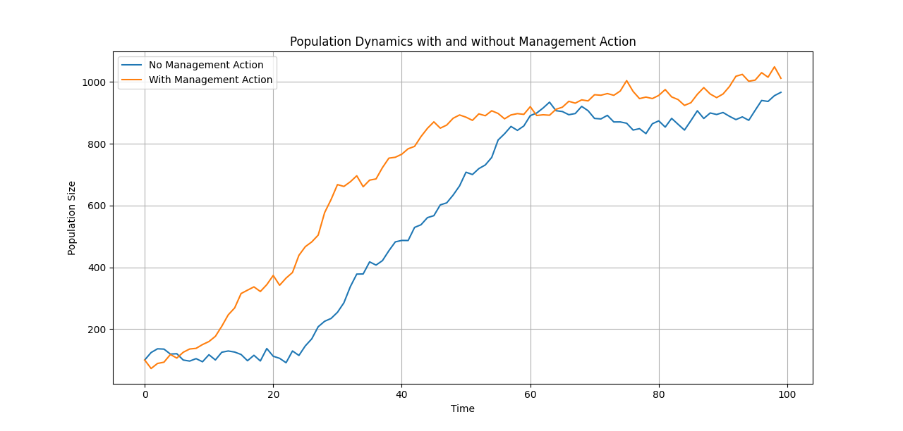

# EcoDecisionSim

**EcoDecisionSim** is a simple ecological simulation tool designed to model population dynamics under uncertainty and to explore the **Value of Information (VOI)** in conservation decision-making. This project demonstrates how limited data, environmental variability, and management interventions interact in ecological systems.

## Features

- Stochastic simulation of population growth using the **logistic growth model** with environmental noise.
- Comparison of scenarios with and without management interventions (e.g., population control measures).
- Toy calculation of the **Value of Information (VOI)** to guide decisions on whether to invest in learning (data collection) or to act immediately.

## Visualization

The graph below shows two population trajectories over time:
- **No Management Action** (blue line) — population grows toward the carrying capacity.
- **With Management Action** (orange line) — growth is slowed by intervention.



This simple visualization highlights how management actions can influence population trajectories and how uncertainty (simulated as random noise) can affect outcomes.

## Value of Information (VOI)

The VOI calculation estimates the expected benefit of collecting additional information before making management decisions, using the formula:

```

VOI = (Benefit of Better Decision × Probability of Correct Decision) - Cost of Learning

````

This represents the trade-off between **acting now** versus **waiting to learn more**—a key theme in ecological management, conservation, and environmental policy.

## Usage

The code is implemented in Python using `numpy` and `matplotlib`. To run the simulation and generate both the plot and VOI estimate:

```bash
python eco_decision_sim.py
````

## Future Work

* Implement multiple simulation runs with confidence intervals to quantify uncertainty more robustly.
* Develop decision thresholds and cost-benefit analysis linked to real-world ecological case studies.
* Incorporate adaptive management strategies with dynamic learning over time.

---

*This project was created as part of a research portfolio for PhD applications in mathematical ecology and decision science.*